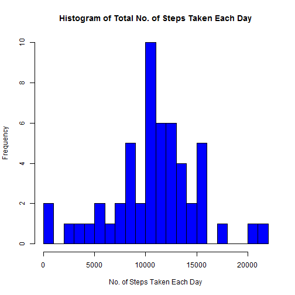
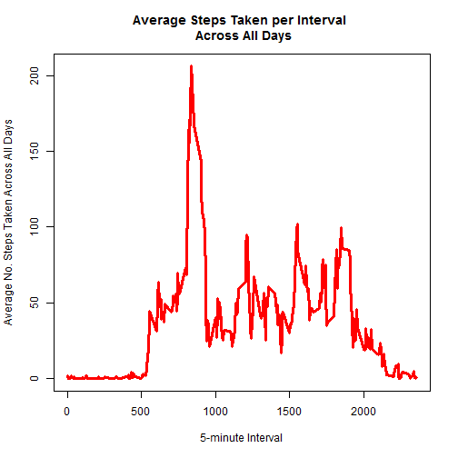
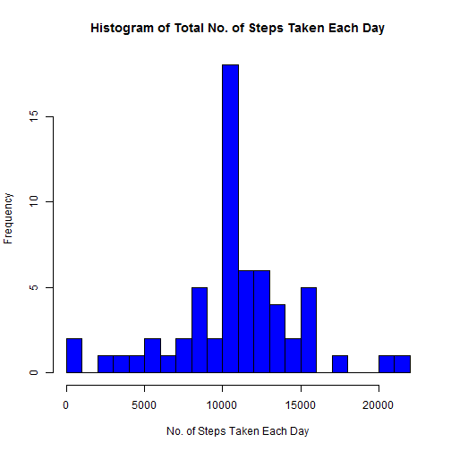
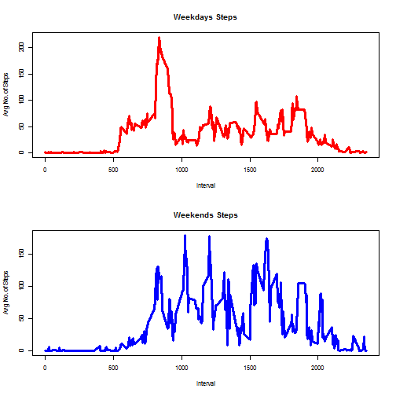

# Reproducible Research: Peer Assessment 1

## Loading and preprocessing the data

If you don't have them already, you need to install the below packages for the code to run without error

```r
install.packages("downloader")
install.packages("dplyr")
```

Require the packages for this R session

```r
library(downloader)
library(dplyr)
```

Download data from the url and unzip it into working directory folder and set downloaded file as new working directory


```r
path <- getwd()
url <- 'https://d396qusza40orc.cloudfront.net/repdata%2Fdata%2Factivity.zip'
download(url,dest=file.path(path,'repdata_data_activity.zip'),mode='wb')
unzip(file.path(path,'repdata_data_activity.zip'))
if(file.exists('repdata_data_activity')){
  setwd(file.path(path,'repdata_data_activity'))}
```

Read data from csv file

```r
dat <- read.csv('activity.csv')
head(dat)
```

```
##   steps       date interval
## 1    NA 2012-10-01        0
## 2    NA 2012-10-01        5
## 3    NA 2012-10-01       10
## 4    NA 2012-10-01       15
## 5    NA 2012-10-01       20
## 6    NA 2012-10-01       25
```

```r
str(dat)
```

```
## 'data.frame':	17568 obs. of  3 variables:
##  $ steps   : int  NA NA NA NA NA NA NA NA NA NA ...
##  $ date    : Factor w/ 61 levels "2012-10-01","2012-10-02",..: 1 1 1 1 1 1 1 1 1 1 ...
##  $ interval: int  0 5 10 15 20 25 30 35 40 45 ...
```

## What is the mean total number of steps taken per day?

1. Using dyplr, group by date and sum the total steps per day

```r
steps_per_day <- dat %>% 
                  group_by(date) %>% 
                  summarize(total_steps=sum(steps))
head(steps_per_day)
```

```
## Source: local data frame [6 x 2]
## 
##         date total_steps
##       (fctr)       (int)
## 1 2012-10-01          NA
## 2 2012-10-02         126
## 3 2012-10-03       11352
## 4 2012-10-04       12116
## 5 2012-10-05       13294
## 6 2012-10-06       15420
```

2. Make a histogram plot of the total number of steps taken each day

```r
hist(steps_per_day$total_steps, breaks=30,
     main='Histogram of Total No. of Steps Taken Each Day',
     xlab='No. of Steps Taken Each Day',
     col='blue')
```



3. Calculate mean and median of the total number of steps taken per day

```r
mean(steps_per_day$total_steps,na.rm=T)
```

```
## [1] 10766.19
```

```r
median(steps_per_day$total_steps,na.rm=T)
```

```
## [1] 10765
```
The mean and median are not equal while ignoring the NA values, meaning that the distribution of number of steps taken per day not normal.

## What is the average daily activity pattern?

1. Time series plot of the 5-minute interval & the average number of steps taken, averaged across all days

```r
avg_steps_interval <- dat %>%
                      group_by(interval) %>%
                      summarize(steps_interval=mean(steps,na.rm=T))
head(avg_steps_interval)
```

```
## Source: local data frame [6 x 2]
## 
##   interval steps_interval
##      (int)          (dbl)
## 1        0      1.7169811
## 2        5      0.3396226
## 3       10      0.1320755
## 4       15      0.1509434
## 5       20      0.0754717
## 6       25      2.0943396
```

```r
plot(avg_steps_interval$steps_interval ~ unique(dat$interval),
    type='l',col='red',lwd=3,
    main='Average Steps Taken per Interval \n Across All Days',
    xlab='5-minute Interval',
    ylab='Average No. Steps Taken Across All Days')
```



2. Which 5-minute interval, on average across all the days in the dataset, contains the maximum number of steps?

```r
avg_steps_interval[avg_steps_interval$steps_interval == max(avg_steps_interval$steps_interval),]
```

```
## Source: local data frame [1 x 2]
## 
##   interval steps_interval
##      (int)          (dbl)
## 1      835       206.1698
```
Interval 835 contains a maximum of approx. 206 steps (averaged across all days).

## Imputing missing values

1. Total number of missing values in the dataset 

```r
nrow(dat[is.na(dat$steps),])
```

```
## [1] 2304
```

2. Create a new dataset that is equal to the original dataset but with the missing data filled in. 
3. Missing values replaced with the mean for that 5-minute interval calculated in a previous point and saved in the avg_steps_interval table


```r
new_dat1 <-  dat %>%
             merge(avg_steps_interval,by.x='interval',by.y='interval') %>%
             filter(is.na(steps)) %>%
             mutate(steps=steps_interval) %>%
             select(steps,date,interval)
head(new_dat1)
```

```
##      steps       date interval
## 1 1.716981 2012-10-01        0
## 2 1.716981 2012-11-04        0
## 3 1.716981 2012-11-30        0
## 4 1.716981 2012-11-14        0
## 5 1.716981 2012-11-09        0
## 6 1.716981 2012-11-01        0
```

```r
new_dat2 <-  dat[!is.na(dat$steps),]
head(new_dat2)
```

```
##     steps       date interval
## 289     0 2012-10-02        0
## 290     0 2012-10-02        5
## 291     0 2012-10-02       10
## 292     0 2012-10-02       15
## 293     0 2012-10-02       20
## 294     0 2012-10-02       25
```

```r
new_dat <-   rbind(new_dat1,new_dat2) %>%
             arrange(date)
head(new_dat)
```

```
##       steps       date interval
## 1 1.7169811 2012-10-01        0
## 2 0.3396226 2012-10-01        5
## 3 0.1320755 2012-10-01       10
## 4 0.1509434 2012-10-01       15
## 5 0.0754717 2012-10-01       20
## 6 2.0943396 2012-10-01       25
```

4. Histogram of the total number of steps taken each day and the mean and median total number of steps taken per day

```r
new_steps_per_day <- new_dat %>% 
                      group_by(date) %>% 
                      summarize(total_steps=sum(steps))
hist(new_steps_per_day$total_steps, breaks=30,
     main='Histogram of Total No. of Steps Taken Each Day',
     xlab='No. of Steps Taken Each Day',
     col='blue')
```



```r
mean(new_steps_per_day$total_steps)
```

```
## [1] 10766.19
```

```r
median(new_steps_per_day$total_steps)
```

```
## [1] 10766.19
```
By inputting missing values we obtained a normal distribution of number of steps taken each day, with mean equal with median.

## Are there differences in activity patterns between weekdays and weekends?

1. Create a new factor variable in the dataset with two levels - "weekday" and "weekend"


```r
new_dat$weekdayT <- ifelse(weekdays(as.POSIXct(new_dat$date)) %in% c("Satuday", "Sunday"), 
                              "weekend", "weekday")
head(new_dat)
```

```
##       steps       date interval weekdayT
## 1 1.7169811 2012-10-01        0  weekday
## 2 0.3396226 2012-10-01        5  weekday
## 3 0.1320755 2012-10-01       10  weekday
## 4 0.1509434 2012-10-01       15  weekday
## 5 0.0754717 2012-10-01       20  weekday
## 6 2.0943396 2012-10-01       25  weekday
```

2. Panel plot of a time series plot of the 5-minute interval & the average number of steps taken, averaged across all weekday days or weekend days

```r
avg_steps_interval_weekday <- new_dat %>%
                              filter(weekdayT=='weekday') %>%
                              group_by(interval) %>%
                              summarize(steps_interval=mean(steps))
avg_steps_interval_weekend <- new_dat %>%
                              filter(weekdayT=='weekend') %>%
                              group_by(interval) %>%
                              summarize(steps_interval=mean(steps))
par(mfrow=c(2,1),cex=0.7)
plot(avg_steps_interval_weekday$steps_interval ~ unique(new_dat$interval),
     type='l',col='red',lwd=3, 
     main='Weekdays Steps', xlab='Interval',ylab='Avg No. of Steps')
plot(avg_steps_interval_weekend$steps_interval ~ unique(new_dat$interval),
     type='l',col='blue',lwd=3, 
     main='Weekends Steps', xlab='Interval', ylab='Avg No. of Steps')
```



Indeed, we can see from the distribution of steps the difference in subject's activity between weekdays and weekends. The average number of steps is distributed differently across the time intervals. 
